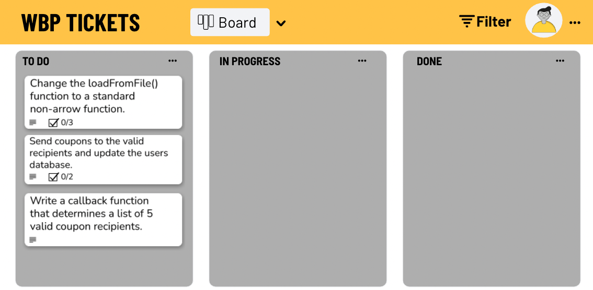

# Callbacks & Arrow Functions

A local grocery store has hired you to help organize coupon distribution.  The grocery store has a database of customers who have given the store their phone numbers.  The store doesn’t want to give away too many coupons at once, so instead of giving all their rewards members the coupon right now, they want to only provide the coupon for a small number of their members at a time.  You’ve been hired to write the program that organizes the progressive rollout of the coupons.

---

- Change the `loadFromFile` function in the `userDatabase.js` file to a standard non-arrow function so that the “this” keyword is rebound and can be used to access the calling object.
    - Remove the `loadFromFile` function keyword, and fix the syntax to match a standard function definition.
- Send coupons to the valid recipients in the `sendCoupon.js` file.
    - Update the database with users who have received coupons.
- Write a callback function in the `giveaway.js` file that determines a list of 5 valid coupon recipients.

---

---

### Preparation Steps

- Fork and clone [this](https://git.generalassemb.ly/SEI-Standard-Curriculum/M1L11-callbacks-wbp/tree/main) repository.
- cd into the directory.

---
### Step 1

- Navigate to `/src/userDatabase/userDatabase.js`

- In this file, there is an object that represents a list of all the users in our database. Become familiar with this database.
- Can you find and fix any syntax and logical errors in this file?
  - You can test your code manually using the supplied function calls at the bottom of the file.
  - Once you are confident in your fixes, you can run the automated tests with this command: `npx jest ./util/userDatabase/userDatabase.test.js`

---
### Step 2

- Navigate to `/src/giveaway/giveaway.js`

- In this file, there is a function that determines if a user is eligible to receive a coupon.
- Your job is to write another function that accepts this function as a callback, and returns all users that are eligible for a coupon.
  - You can test your code manually using the supplied function calls at the bottom of the file
  - Once you are confident in your fixes, you can run the automated tests with this command: `npx jest ./util/giveaway/giveaway.test.js`

---
### Step 3

- Navigate to `/src/sendCoupons/sendCoupons.js`
- In this file, there are 3 functions defined: `canSendCoupon()`, `sendCoupon()`, and `updateUserCouponSent`. You should not edit any of these existing functions. 
- Your job is to write a function called `sendAllCoupons()` that accepts a list of users, and all 3 existing functions in this file as arguments.
- Your function should check each user for a valid phone number. Then, if the phone number was valid, print a coupon and update the user in the database.
  - You can test your code manually using the supplied function calls at the bottom of the file
  - Once you are confident in your fixes, you can run the automated tests with this command: `npx jest ./util/sendCoupons/sendCoupons.test.js`
